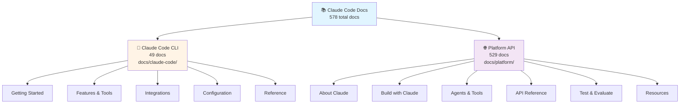
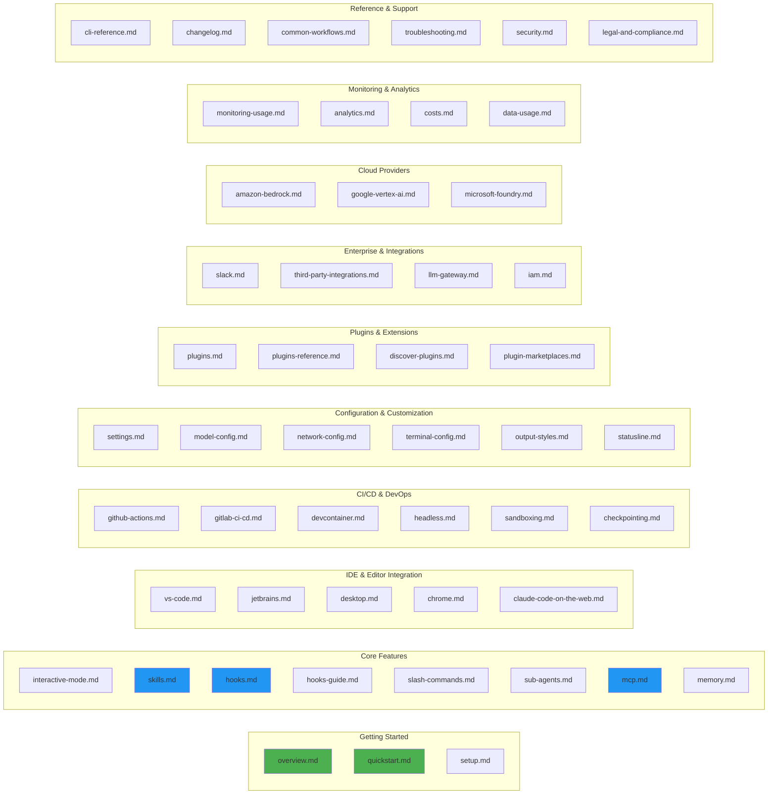
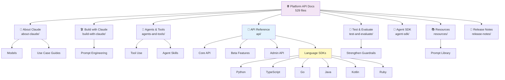
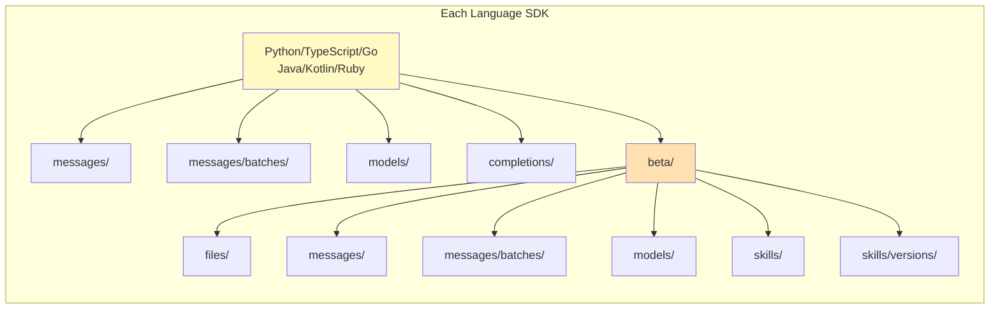
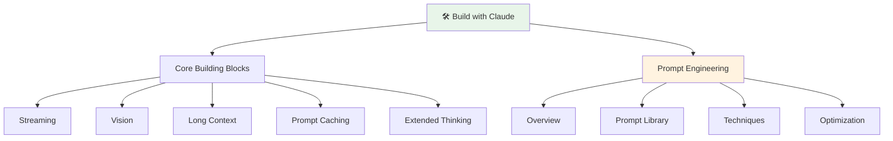
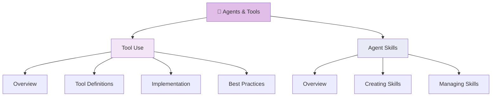
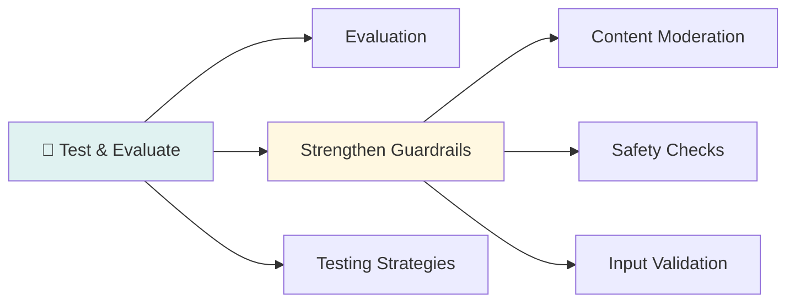
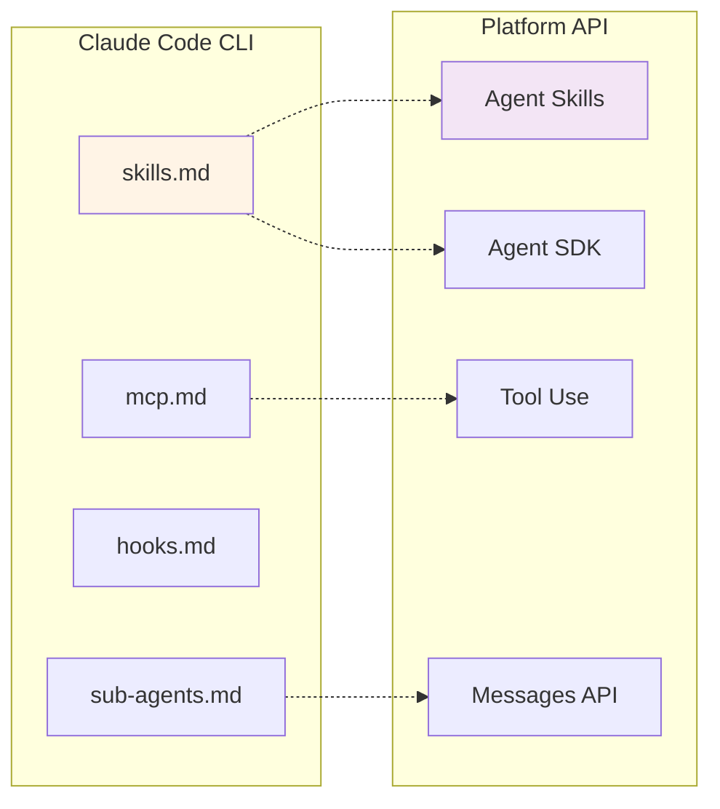

# Documentation Map

This repository contains **578 documentation files** from two sources:
- **Claude Code CLI**: 49 documentation files (flat structure)
- **Platform API**: 529 documentation files (hierarchical structure)

## Overview



## Claude Code CLI Documentation (49 docs)



## Platform API Documentation (529 docs)

### High-Level Structure



### API Reference Structure (Language SDKs)

The API documentation is replicated across 6 language SDKs, each with identical structure:



### Build with Claude



### Agents & Tools



### Test & Evaluate



## Documentation Categories Summary

### Claude Code CLI (49 docs)

| Category | Count | Key Topics |
|----------|-------|------------|
| **Getting Started** | 3 | Overview, Quickstart, Setup |
| **Core Features** | 8 | Skills, Hooks, MCP, Slash Commands, Sub-agents, Memory |
| **IDE Integration** | 5 | VS Code, JetBrains, Desktop, Chrome, Web |
| **CI/CD & DevOps** | 6 | GitHub Actions, GitLab, Containers, Headless, Sandboxing |
| **Configuration** | 6 | Settings, Models, Network, Terminal, Output Styles, Statusline |
| **Plugins** | 4 | Plugins, Reference, Discovery, Marketplaces |
| **Enterprise** | 4 | Slack, Third-party, LLM Gateway, IAM |
| **Cloud Providers** | 3 | AWS Bedrock, Google Vertex, Microsoft Foundry |
| **Monitoring** | 4 | Usage, Analytics, Costs, Data Usage |
| **Reference** | 6 | CLI Reference, Changelog, Workflows, Troubleshooting, Security, Legal |

### Platform API (529 docs)

| Category | Approx Count | Key Topics |
|----------|--------------|------------|
| **About Claude** | ~20 | Models, Use Cases, Capabilities |
| **Build with Claude** | ~30 | Streaming, Vision, Caching, Prompt Engineering |
| **Agents & Tools** | ~25 | Tool Use, Agent Skills, Implementation |
| **API Reference** | ~400 | Messages, Models, Admin, Language SDKs (6 languages) |
| **Test & Evaluate** | ~15 | Testing, Guardrails, Validation |
| **Agent SDK** | ~10 | SDK Setup, Examples, Integration |
| **Resources** | ~20 | Prompt Library, Examples, Guides |
| **Release Notes** | ~9 | API Updates, Changelog |

## Cross-References Between Documentation

Key relationships between Claude Code and Platform docs:



## File Organization

```
docs/
├── claude-code/          # 49 files (flat structure)
│   ├── overview.md
│   ├── quickstart.md
│   ├── skills.md
│   ├── hooks.md
│   ├── mcp.md
│   └── ... (44 more)
│
└── platform/             # 529 files (hierarchical structure)
    ├── intro.md
    ├── about-claude/
    │   ├── models/
    │   └── use-case-guides/
    ├── build-with-claude/
    │   └── prompt-engineering/
    ├── agents-and-tools/
    │   ├── tool-use/
    │   └── agent-skills/
    ├── api/
    │   ├── messages/
    │   ├── models/
    │   ├── admin/
    │   ├── beta/
    │   ├── python/
    │   ├── typescript/
    │   ├── go/
    │   ├── java/
    │   ├── kotlin/
    │   └── ruby/
    ├── test-and-evaluate/
    │   └── strengthen-guardrails/
    ├── agent-sdk/
    ├── resources/
    │   └── prompt-library/
    └── release-notes/
```

## Quick Navigation Guide

### Finding Documentation

Use the helper script to navigate:

```bash
# List all docs
/docs

# Search both sources automatically
/docs hooks              # → claude-code/hooks.md
/docs streaming          # → platform/build-with-claude/streaming.md

# Explicit source selection
/docs claude-code/skills
/docs platform/api/messages/overview

# Check what's new
/docs what's new
```

### Documentation Manifest

The `docs_manifest.json` file contains metadata for all 578 documentation files:
- File paths (relative to docs/)
- Source URLs (original documentation location)
- Content hashes (for change detection)
- Last updated timestamps

Use the manifest to programmatically discover and track documentation changes.
