# Documentation Map

This repository contains **578 documentation files** from two sources:
- **Claude Code CLI**: 49 documentation files (flat structure)
- **Platform API**: 529 documentation files (hierarchical structure)

## Overview

```mermaid
graph TB
    ROOT[📚 Claude Code Docs<br/>578 total docs]

    ROOT --> CODE[🔧 Claude Code CLI<br/>49 docs<br/>docs/claude-code/]
    ROOT --> PLATFORM[🌐 Platform API<br/>529 docs<br/>docs/platform/]

    CODE --> CODE_GETTING_STARTED[Getting Started]
    CODE --> CODE_FEATURES[Features & Tools]
    CODE --> CODE_INTEGRATIONS[Integrations]
    CODE --> CODE_CONFIG[Configuration]
    CODE --> CODE_REFERENCE[Reference]

    PLATFORM --> PLAT_ABOUT[About Claude]
    PLATFORM --> PLAT_BUILD[Build with Claude]
    PLATFORM --> PLAT_AGENTS[Agents & Tools]
    PLATFORM --> PLAT_API[API Reference]
    PLATFORM --> PLAT_TEST[Test & Evaluate]
    PLATFORM --> PLAT_RESOURCES[Resources]

    style ROOT fill:#e1f5ff
    style CODE fill:#fff4e6
    style PLATFORM fill:#f3e5f5
```



## Claude Code CLI Documentation (49 docs)


## Platform API Documentation (529 docs)

### High-Level Structure

```mermaid
graph TB
    PLATFORM[🌐 Platform API Docs<br/>529 files]

    PLATFORM --> ABOUT[📖 About Claude<br/>about-claude/]
    PLATFORM --> BUILD[🛠️ Build with Claude<br/>build-with-claude/]
    PLATFORM --> AGENTS[🤖 Agents & Tools<br/>agents-and-tools/]
    PLATFORM --> API[📡 API Reference<br/>api/]
    PLATFORM --> TEST[🧪 Test & Evaluate<br/>test-and-evaluate/]
    PLATFORM --> SDK[🔧 Agent SDK<br/>agent-sdk/]
    PLATFORM --> RESOURCES[📚 Resources<br/>resources/]
    PLATFORM --> RELEASE[📝 Release Notes<br/>release-notes/]

    ABOUT --> MODELS[Models]
    ABOUT --> USECASES[Use Case Guides]

    BUILD --> PROMPT_ENG[Prompt Engineering]

    AGENTS --> TOOL_USE[Tool Use]
    AGENTS --> AGENT_SKILLS[Agent Skills]

    API --> API_CORE[Core API]
    API --> API_BETA[Beta Features]
    API --> API_ADMIN[Admin API]
    API --> API_SDKS[Language SDKs]

    API_SDKS --> PYTHON[Python]
    API_SDKS --> TYPESCRIPT[TypeScript]
    API_SDKS --> GO[Go]
    API_SDKS --> JAVA[Java]
    API_SDKS --> KOTLIN[Kotlin]
    API_SDKS --> RUBY[Ruby]

    TEST --> GUARDRAILS[Strengthen Guardrails]

    RESOURCES --> PROMPT_LIB[Prompt Library]

    style PLATFORM fill:#f3e5f5
    style API fill:#e3f2fd
    style API_SDKS fill:#fff9c4
```



### API Reference Structure (Language SDKs)

The API documentation is replicated across 6 language SDKs, each with identical structure:


### Build with Claude


### Agents & Tools

```mermaid
graph TB
    AGENTS[🤖 Agents & Tools]

    AGENTS --> TOOL_USE[Tool Use]
    AGENTS --> AGENT_SKILLS[Agent Skills]

    TOOL_USE --> TOOL_OVERVIEW[Overview]
    TOOL_USE --> TOOL_DEF[Tool Definitions]
    TOOL_USE --> TOOL_IMPL[Implementation]
    TOOL_USE --> TOOL_BEST[Best Practices]

    AGENT_SKILLS --> SKILL_OVERVIEW[Overview]
    AGENT_SKILLS --> SKILL_CREATE[Creating Skills]
    AGENT_SKILLS --> SKILL_MANAGE[Managing Skills]

    style AGENTS fill:#e1bee7
    style TOOL_USE fill:#f3e5f5
    style AGENT_SKILLS fill:#e8eaf6
```



### Test & Evaluate

```mermaid
graph LR
    TEST[🧪 Test & Evaluate]

    TEST --> EVAL[Evaluation]
    TEST --> GUARD[Strengthen Guardrails]
    TEST --> TESTING[Testing Strategies]

    GUARD --> MODERATION[Content Moderation]
    GUARD --> SAFETY[Safety Checks]
    GUARD --> VALIDATION[Input Validation]

    style TEST fill:#e0f2f1
    style GUARD fill:#fff8e1
```



## Documentation Categories Summary

### Claude Code CLI (49 docs)

| Category | Count | Key Topics |
|----------|-------|------------|
| **Getting Started** | 3 | Overview, Quickstart, Setup |
| **Core Features** | 8 | Skills, Hooks, MCP, Slash Commands, Sub-agents, Memory |
| **IDE Integration** | 5 | VS Code, JetBrains, Desktop, Chrome, Web |
| **CI/CD & DevOps** | 6 | GitHub Actions, GitLab, Containers, Headless, Sandboxing |
| **Configuration** | 6 | Settings, Models, Network, Terminal, Output Styles, Statusline |
| **Plugins** | 4 | Plugins, Reference, Discovery, Marketplaces |
| **Enterprise** | 4 | Slack, Third-party, LLM Gateway, IAM |
| **Cloud Providers** | 3 | AWS Bedrock, Google Vertex, Microsoft Foundry |
| **Monitoring** | 4 | Usage, Analytics, Costs, Data Usage |
| **Reference** | 6 | CLI Reference, Changelog, Workflows, Troubleshooting, Security, Legal |

### Platform API (529 docs)

| Category | Approx Count | Key Topics |
|----------|--------------|------------|
| **About Claude** | ~20 | Models, Use Cases, Capabilities |
| **Build with Claude** | ~30 | Streaming, Vision, Caching, Prompt Engineering |
| **Agents & Tools** | ~25 | Tool Use, Agent Skills, Implementation |
| **API Reference** | ~400 | Messages, Models, Admin, Language SDKs (6 languages) |
| **Test & Evaluate** | ~15 | Testing, Guardrails, Validation |
| **Agent SDK** | ~10 | SDK Setup, Examples, Integration |
| **Resources** | ~20 | Prompt Library, Examples, Guides |
| **Release Notes** | ~9 | API Updates, Changelog |

## Cross-References Between Documentation

Key relationships between Claude Code and Platform docs:


## File Organization

```
docs/
├── claude-code/          # 49 files (flat structure)
│   ├── overview.md
│   ├── quickstart.md
│   ├── skills.md
│   ├── hooks.md
│   ├── mcp.md
│   └── ... (44 more)
│
└── platform/             # 529 files (hierarchical structure)
    ├── intro.md
    ├── about-claude/
    │   ├── models/
    │   └── use-case-guides/
    ├── build-with-claude/
    │   └── prompt-engineering/
    ├── agents-and-tools/
    │   ├── tool-use/
    │   └── agent-skills/
    ├── api/
    │   ├── messages/
    │   ├── models/
    │   ├── admin/
    │   ├── beta/
    │   ├── python/
    │   ├── typescript/
    │   ├── go/
    │   ├── java/
    │   ├── kotlin/
    │   └── ruby/
    ├── test-and-evaluate/
    │   └── strengthen-guardrails/
    ├── agent-sdk/
    ├── resources/
    │   └── prompt-library/
    └── release-notes/
```

## Quick Navigation Guide

### Finding Documentation

Use the helper script to navigate:

```bash
# List all docs
/docs

# Search both sources automatically
/docs hooks              # → claude-code/hooks.md
/docs streaming          # → platform/build-with-claude/streaming.md

# Explicit source selection
/docs claude-code/skills
/docs platform/api/messages/overview

# Check what's new
/docs what's new
```

### Documentation Manifest

The `docs_manifest.json` file contains metadata for all 578 documentation files:
- File paths (relative to docs/)
- Source URLs (original documentation location)
- Content hashes (for change detection)
- Last updated timestamps

Use the manifest to programmatically discover and track documentation changes.
