# Claude Code Documentation Map

This comprehensive map shows the relationships between all 49 documentation files in the Claude Code documentation set.

## Quick Navigation

- **🚀 Getting Started**: [overview](#overview-quickstart-setup)
- **⚙️ Configuration**: [settings](#settings-configuration)
- **🔧 Core Features**: [hooks, mcp, plugins](#extensibility-integrations)
- **💻 IDE & Platform**: [vs-code, desktop, chrome](#platforms-ides)
- **🔒 Security & Access**: [security, iam, data-usage](#security-compliance)

---

## Documentation Structure

```mermaid
graph TB
    %% Color coding and styling
    classDef getting-started fill:#e1f5e1,stroke:#4caf50,stroke-width:3px
    classDef config fill:#fff3e0,stroke:#ff9800,stroke-width:2px
    classDef features fill:#e3f2fd,stroke:#2196f3,stroke-width:2px
    classDef extensibility fill:#f3e5f5,stroke:#9c27b0,stroke-width:2px
    classDef integrations fill:#fce4ec,stroke:#e91e63,stroke-width:2px
    classDef platforms fill:#e0f2f1,stroke:#009688,stroke-width:2px
    classDef security fill:#ffebee,stroke:#f44336,stroke-width:3px
    classDef workflows fill:#e8f5e9,stroke:#8bc34a,stroke-width:2px
    classDef reference fill:#f5f5f5,stroke:#607d8b,stroke-width:2px

    %% GETTING STARTED CLUSTER
    subgraph GettingStarted["🚀 GETTING STARTED"]
        overview[overview.md<br/>Main entry point]
        quickstart[quickstart.md<br/>5-min setup]
        setup[setup.md<br/>Installation &amp; auth]
        troubleshooting[troubleshooting.md<br/>Common issues]
    end

    %% CORE CONFIGURATION CLUSTER
    subgraph CoreConfig["⚙️ CONFIGURATION"]
        settings[settings.md<br/>Central config]
        memory[memory.md<br/>CLAUDE.md files]
        model-config[model-config.md<br/>Model selection]
        iam[iam.md<br/>Access control]
        cli-reference[cli-reference.md<br/>CLI commands]
        terminal-config[terminal-config.md<br/>Terminal setup]
        network-config[network-config.md<br/>Network &amp; proxy]
    end

    %% CORE FEATURES CLUSTER
    subgraph CoreFeatures["💡 CORE FEATURES"]
        interactive-mode[interactive-mode.md<br/>REPL usage]
        slash-commands[slash-commands.md<br/>Built-in &amp; custom]
        skills[skills.md<br/>Agent Skills]
        sub-agents[sub-agents.md<br/>Specialized agents]
        checkpointing[checkpointing.md<br/>Save &amp; resume]
        statusline[statusline.md<br/>Status display]
        output-styles[output-styles.md<br/>Response formatting]
    end

    %% EXTENSIBILITY &amp; INTEGRATIONS CLUSTER
    subgraph Extensibility["🔧 EXTENSIBILITY"]
        hooks[hooks.md<br/>Event hooks ref]
        hooks-guide[hooks-guide.md<br/>Hooks quickstart]
        mcp[mcp.md<br/>MCP protocol]
        plugins[plugins.md<br/>Create plugins]
        plugins-reference[plugins-reference.md<br/>Plugin API]
        discover-plugins[discover-plugins.md<br/>Install plugins]
        plugin-marketplaces[plugin-marketplaces.md<br/>Distribute plugins]
    end

    %% CLOUD &amp; THIRD-PARTY CLUSTER
    subgraph CloudIntegrations["☁️ CLOUD &amp; INTEGRATIONS"]
        third-party-integrations[third-party-integrations.md<br/>Overview]
        amazon-bedrock[amazon-bedrock.md<br/>AWS Bedrock]
        google-vertex-ai[google-vertex-ai.md<br/>GCP Vertex]
        microsoft-foundry[microsoft-foundry.md<br/>Azure Foundry]
        llm-gateway[llm-gateway.md<br/>LLM gateways]
        github-actions[github-actions.md<br/>CI/CD]
        gitlab-ci-cd[gitlab-ci-cd.md<br/>GitLab CI/CD]
    end

    %% PLATFORMS &amp; IDES CLUSTER
    subgraph Platforms["💻 PLATFORMS &amp; IDEs"]
        vs-code[vs-code.md<br/>VS Code]
        jetbrains[jetbrains.md<br/>JetBrains IDEs]
        desktop[desktop.md<br/>Claude Desktop]
        chrome[chrome.md<br/>Browser automation]
        devcontainer[devcontainer.md<br/>Dev containers]
        slack[slack.md<br/>Slack integration]
        claude-code-on-the-web[claude-code-on-the-web.md<br/>Web sessions]
    end

    %% SECURITY &amp; COMPLIANCE CLUSTER
    subgraph SecurityCompliance["🔒 SECURITY &amp; COMPLIANCE"]
        security[security.md<br/>Security overview]
        data-usage[data-usage.md<br/>Privacy &amp; data]
        legal-and-compliance[legal-and-compliance.md<br/>Compliance]
        sandboxing[sandboxing.md<br/>Bash isolation]
    end

    %% WORKFLOWS &amp; PATTERNS CLUSTER
    subgraph Workflows["📋 WORKFLOWS"]
        common-workflows[common-workflows.md<br/>Patterns &amp; examples]
        headless[headless.md<br/>SDK &amp; automation]
    end

    %% REFERENCE &amp; MONITORING CLUSTER
    subgraph Reference["📚 REFERENCE"]
        costs[costs.md<br/>Token tracking]
        monitoring-usage[monitoring-usage.md<br/>Telemetry]
        analytics[analytics.md<br/>Usage stats]
        changelog[changelog.md<br/>Release notes]
    end

    %% ============================================
    %% PRIMARY NAVIGATION FLOWS
    %% ============================================

    %% Getting Started flows
    overview -->|Quick setup| quickstart
    overview -->|Advanced setup| setup
    overview -->|Issues?| troubleshooting
    quickstart -->|Full config| settings
    quickstart -->|Common tasks| common-workflows
    setup -->|Auth methods| iam

    %% Configuration flows
    settings -->|Memory files| memory
    settings -->|Choose model| model-config
    settings -->|Access control| iam
    settings -->|CLI flags| cli-reference
    settings -->|Terminal keys| terminal-config
    settings -->|Proxy setup| network-config
    memory -->|Import rules| settings
    iam -->|Hook validation| hooks

    %% Core Features flows
    interactive-mode -->|Commands| slash-commands
    interactive-mode -->|Status| statusline
    slash-commands -->|Custom| skills
    slash-commands -->|Delegate| sub-agents
    skills -->|Agents use| sub-agents
    sub-agents -->|Background| checkpointing

    %% Extensibility flows
    hooks-guide -->|Reference| hooks
    hooks -->|Used by| plugins
    mcp -->|Plugin servers| plugins
    plugins -->|API reference| plugins-reference
    plugins -->|Install| discover-plugins
    discover-plugins -->|Create own| plugin-marketplaces
    skills -->|In plugins| plugins
    sub-agents -->|In plugins| plugins

    %% Cloud Integration flows
    third-party-integrations -->|AWS| amazon-bedrock
    third-party-integrations -->|GCP| google-vertex-ai
    third-party-integrations -->|Azure| microsoft-foundry
    third-party-integrations -->|Gateway| llm-gateway
    setup -->|Cloud auth| third-party-integrations
    github-actions -->|CI/CD| headless
    gitlab-ci-cd -->|CI/CD| headless

    %% Platform flows
    vs-code -->|Browser| chrome
    jetbrains -->|Remote| claude-code-on-the-web
    desktop -->|MCP| mcp
    chrome -->|Automation| common-workflows
    devcontainer -->|CI| github-actions

    %% Security flows
    security -->|Privacy| data-usage
    security -->|Bash| sandboxing
    security -->|Policy| legal-and-compliance
    iam -->|Permissions| security
    sandboxing -->|Restrictions| iam

    %% Workflow flows
    common-workflows -->|Automation| headless
    common-workflows -->|Skills| skills
    common-workflows -->|Hooks| hooks-guide
    headless -->|Monitor| monitoring-usage

    %% Reference flows
    costs -->|Telemetry| monitoring-usage
    monitoring-usage -->|Stats| analytics
    settings -->|Track costs| costs

    %% ============================================
    %% CROSS-CUTTING RELATIONSHIPS
    %% ============================================

    %% MCP ecosystem
    mcp -.->|Resources| common-workflows
    mcp -.->|Servers| discover-plugins
    mcp -.->|Permissions| iam

    %% Hooks ecosystem
    hooks -.->|Events| sub-agents
    hooks -.->|Security| iam
    hooks -.->|Scripts| common-workflows

    %% Settings references
    settings -.->|Hooks| hooks
    settings -.->|Sandbox| sandboxing
    settings -.->|Tools| iam
    settings -.->|Env vars| network-config

    %% Plugin ecosystem
    plugins -.->|Commands| slash-commands
    plugins -.->|Hooks| hooks
    plugins -.->|MCP| mcp
    plugins -.->|Skills| skills

    %% Troubleshooting cross-refs
    troubleshooting -.->|Auth| iam
    troubleshooting -.->|Network| network-config
    troubleshooting -.->|MCP| mcp
    troubleshooting -.->|Updates| changelog

    %% Cloud provider cross-refs
    amazon-bedrock -.->|Auth| iam
    google-vertex-ai -.->|Auth| iam
    microsoft-foundry -.->|Auth| iam
    llm-gateway -.->|Config| settings

    %% Workflow cross-refs
    common-workflows -.->|Plan mode| sub-agents
    common-workflows -.->|Images| interactive-mode
    common-workflows -.->|Resume| checkpointing
    common-workflows -.->|Thinking| model-config

    %% Apply styles
    class overview,quickstart,setup,troubleshooting getting-started
    class settings,memory,model-config,cli-reference,terminal-config,network-config config
    class interactive-mode,slash-commands,checkpointing,statusline,output-styles features
    class skills,sub-agents workflows
    class hooks,hooks-guide,mcp,plugins,plugins-reference,discover-plugins,plugin-marketplaces extensibility
    class third-party-integrations,amazon-bedrock,google-vertex-ai,microsoft-foundry,llm-gateway,github-actions,gitlab-ci-cd integrations
    class vs-code,jetbrains,desktop,chrome,devcontainer,slack,claude-code-on-the-web platforms
    class security,data-usage,legal-and-compliance,sandboxing,iam security
    class common-workflows,headless workflows
    class costs,monitoring-usage,analytics,changelog reference
```



---

## 📖 Documentation Categories

### 🚀 Getting Started (4 docs)
Entry points for new users. Start here.

| Document | Purpose | Next Steps |
|----------|---------|------------|
| **overview.md** | Product overview & 30-second install | → quickstart, setup |
| **quickstart.md** | 5-minute guided tutorial | → common-workflows, settings |
| **setup.md** | Detailed installation & auth | → iam, third-party-integrations |
| **troubleshooting.md** | Problem resolution | → (various, as needed) |

### ⚙️ Configuration (7 docs)
System settings, authentication, and customization.

| Document | Purpose | Key Topics |
|----------|---------|-----------|
| **settings.md** | Central configuration hub | JSON files, env vars, scopes |
| **memory.md** | Persistent context (CLAUDE.md) | Project/user memory, rules/ directory |
| **model-config.md** | Model selection & switching | Aliases, env vars, performance |
| **iam.md** | Access control & auth | Permissions, working dirs, credentials |
| **cli-reference.md** | Command-line flags & options | All CLI arguments |
| **terminal-config.md** | Terminal keybindings | Shift+Enter, platform setup |
| **network-config.md** | Proxy & network settings | HTTP_PROXY, certificates |

### 💡 Core Features (7 docs)
Primary functionality and interaction modes.

| Document | Purpose | Key Capabilities |
|----------|---------|-----------------|
| **interactive-mode.md** | REPL interface & shortcuts | Keyboard shortcuts, input modes |
| **slash-commands.md** | Built-in & custom commands | Command creation, arguments, frontmatter |
| **skills.md** | Agent Skills (model-invoked) | SKILL.md, progressive disclosure |
| **sub-agents.md** | Specialized AI agents | Task delegation, forking context |
| **checkpointing.md** | Session management | Save/resume, background tasks |
| **statusline.md** | Custom status display | Command hooks, context display |
| **output-styles.md** | Response formatting | Explanatory, concise, expert modes |

### 🔧 Extensibility & Integrations (7 docs)
Extend Claude Code with custom functionality.

| Document | Purpose | Extensibility Type |
|----------|---------|-------------------|
| **hooks.md** | Event handling reference | PreToolUse, PostToolUse, lifecycle events |
| **hooks-guide.md** | Hooks quickstart | Examples, patterns |
| **mcp.md** | Model Context Protocol | External tools, servers, resources |
| **plugins.md** | Create custom plugins | Commands, agents, skills, MCP |
| **plugins-reference.md** | Plugin API specification | Directory structure, manifest schema |
| **discover-plugins.md** | Install & manage plugins | Marketplaces, installation |
| **plugin-marketplaces.md** | Distribute plugins | Create marketplaces, distribution |

### ☁️ Cloud & Third-Party (7 docs)
Cloud providers, CI/CD, and external integrations.

| Document | Purpose | Integration Type |
|----------|---------|-----------------|
| **third-party-integrations.md** | Integration overview | Cloud providers summary |
| **amazon-bedrock.md** | AWS Bedrock setup | AWS auth, cross-region |
| **google-vertex-ai.md** | Google Cloud setup | GCP auth, regions |
| **microsoft-foundry.md** | Azure setup | Azure auth, endpoints |
| **llm-gateway.md** | LLM gateway support | Custom endpoints |
| **github-actions.md** | GitHub CI/CD | Workflows, automation |
| **gitlab-ci-cd.md** | GitLab CI/CD | Pipeline integration |

### 💻 Platforms & IDEs (7 docs)
Platform-specific integrations and environments.

| Document | Purpose | Platform |
|----------|---------|----------|
| **vs-code.md** | VS Code integration | Extension, features |
| **jetbrains.md** | JetBrains IDEs | IntelliJ, PyCharm, etc. |
| **desktop.md** | Claude Desktop app | Desktop integration |
| **chrome.md** | Browser automation | Web testing, CDP |
| **devcontainer.md** | Development containers | Docker, remote dev |
| **slack.md** | Slack integration | Team collaboration |
| **claude-code-on-the-web.md** | Remote web sessions | Cloud execution |

### 🔒 Security & Compliance (4 docs)
Security, privacy, and compliance features.

| Document | Purpose | Focus Area |
|----------|---------|------------|
| **security.md** | Security overview | Safeguards, best practices |
| **data-usage.md** | Privacy & data handling | What's sent, retention |
| **legal-and-compliance.md** | Compliance frameworks | SOC 2, GDPR, HIPAA |
| **sandboxing.md** | Bash command isolation | Filesystem/network isolation |

### 📋 Workflows & Patterns (2 docs)
Common usage patterns and automation.

| Document | Purpose | Content Type |
|----------|---------|--------------|
| **common-workflows.md** | Usage patterns & examples | Step-by-step guides |
| **headless.md** | SDK & automation | Non-interactive usage |

### 📚 Reference & Monitoring (4 docs)
Usage tracking, costs, and release information.

| Document | Purpose | Metric Type |
|----------|---------|-------------|
| **costs.md** | Token usage & optimization | Cost tracking, reduction strategies |
| **monitoring-usage.md** | Telemetry & observability | OTEL, metrics export |
| **analytics.md** | Usage analytics | Session stats, patterns |
| **changelog.md** | Release notes | Version history, updates |

---

## 🔗 Key Relationships

### Configuration Chain
```
settings.md → memory.md → model-config.md → iam.md
     ↓
hooks.md, sandboxing.md, network-config.md
```

### Extensibility Stack
```
hooks.md ← hooks-guide.md
     ↓
plugins.md → plugins-reference.md → discover-plugins.md → plugin-marketplaces.md
     ↓
mcp.md, skills.md, sub-agents.md
```

### Platform Integration
```
setup.md → third-party-integrations.md
     ↓
amazon-bedrock.md, google-vertex-ai.md, microsoft-foundry.md
     ↓
iam.md (auth)
```

### Feature Discovery
```
overview.md → quickstart.md → common-workflows.md
     ↓                           ↓
interactive-mode.md         skills.md, sub-agents.md
     ↓
slash-commands.md → hooks-guide.md → mcp.md
```

---

## 🎯 User Journey Maps

### New User Path
1. **overview.md** - Understand what Claude Code is
2. **quickstart.md** - Get started in 5 minutes
3. **common-workflows.md** - Learn common tasks
4. **settings.md** - Customize behavior
5. **troubleshooting.md** - Solve issues

### Developer Path
1. **setup.md** - Detailed installation
2. **cli-reference.md** - CLI options
3. **hooks-guide.md** - Extend with hooks
4. **plugins.md** - Create plugins
5. **mcp.md** - Add external tools

### Enterprise Path
1. **iam.md** - Access control setup
2. **security.md** - Security review
3. **third-party-integrations.md** - Cloud deployment
4. **monitoring-usage.md** - Usage tracking
5. **legal-and-compliance.md** - Compliance verification

### Automation Path
1. **headless.md** - SDK usage
2. **github-actions.md** - CI/CD setup
3. **hooks.md** - Event automation
4. **costs.md** - Cost optimization
5. **monitoring-usage.md** - Telemetry

---

## 📊 Document Statistics

- **Total Documents**: 49
- **Categories**: 8
- **Entry Points**: 4 (overview, quickstart, setup, troubleshooting)
- **Configuration Docs**: 7
- **Feature Docs**: 7
- **Extensibility Docs**: 7
- **Integration Docs**: 14 (cloud + platforms)
- **Security Docs**: 4
- **Reference Docs**: 6

---

## 🔍 Quick Reference by Topic

### Authentication & Access
- iam.md, security.md, data-usage.md, setup.md

### Customization
- settings.md, memory.md, hooks.md, skills.md, plugins.md

### External Integrations
- mcp.md, third-party-integrations.md, amazon-bedrock.md, google-vertex-ai.md, microsoft-foundry.md

### Development Workflow
- common-workflows.md, interactive-mode.md, slash-commands.md, sub-agents.md

### Automation & CI/CD
- headless.md, github-actions.md, gitlab-ci-cd.md, hooks.md

### IDE & Platform
- vs-code.md, jetbrains.md, desktop.md, chrome.md, devcontainer.md

### Monitoring & Costs
- costs.md, monitoring-usage.md, analytics.md

### Troubleshooting
- troubleshooting.md (→ links to many other docs as needed)

---

## 📝 Documentation Maintenance Notes

### High-Traffic Entry Points
Focus updates here for maximum impact:
1. overview.md
2. quickstart.md
3. common-workflows.md
4. troubleshooting.md
5. settings.md

### Cross-Reference Clusters
These docs reference each other heavily:
- **Config cluster**: settings, memory, iam, hooks
- **Extensibility cluster**: hooks, mcp, plugins, skills, sub-agents
- **Cloud cluster**: third-party-integrations, amazon-bedrock, google-vertex-ai, microsoft-foundry
- **Platform cluster**: vs-code, jetbrains, desktop, chrome

### Standalone Documents
Can be updated independently:
- changelog.md
- analytics.md
- statusline.md
- output-styles.md
- terminal-config.md

---

*Generated: 2026-01-17*
*Documentation Version: Claude Code v2.x*
*Total Files Analyzed: 49*
