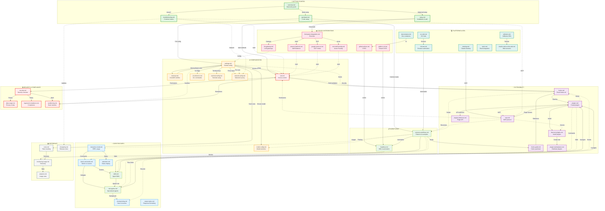

```mermaid
graph TB
    %% Color coding and styling
    classDef getting-started fill:#e1f5e1,stroke:#4caf50,stroke-width:3px
    classDef config fill:#fff3e0,stroke:#ff9800,stroke-width:2px
    classDef features fill:#e3f2fd,stroke:#2196f3,stroke-width:2px
    classDef extensibility fill:#f3e5f5,stroke:#9c27b0,stroke-width:2px
    classDef integrations fill:#fce4ec,stroke:#e91e63,stroke-width:2px
    classDef platforms fill:#e0f2f1,stroke:#009688,stroke-width:2px
    classDef security fill:#ffebee,stroke:#f44336,stroke-width:3px
    classDef workflows fill:#e8f5e9,stroke:#8bc34a,stroke-width:2px
    classDef reference fill:#f5f5f5,stroke:#607d8b,stroke-width:2px

    %% GETTING STARTED CLUSTER
    subgraph GettingStarted["🚀 GETTING STARTED"]
        overview[overview.md<br/>Main entry point]
        quickstart[quickstart.md<br/>5-min setup]
        setup[setup.md<br/>Installation &amp; auth]
        troubleshooting[troubleshooting.md<br/>Common issues]
    end

    %% CORE CONFIGURATION CLUSTER
    subgraph CoreConfig["⚙️ CONFIGURATION"]
        settings[settings.md<br/>Central config]
        memory[memory.md<br/>CLAUDE.md files]
        model-config[model-config.md<br/>Model selection]
        iam[iam.md<br/>Access control]
        cli-reference[cli-reference.md<br/>CLI commands]
        terminal-config[terminal-config.md<br/>Terminal setup]
        network-config[network-config.md<br/>Network &amp; proxy]
    end

    %% CORE FEATURES CLUSTER
    subgraph CoreFeatures["💡 CORE FEATURES"]
        interactive-mode[interactive-mode.md<br/>REPL usage]
        slash-commands[slash-commands.md<br/>Built-in &amp; custom]
        skills[skills.md<br/>Agent Skills]
        sub-agents[sub-agents.md<br/>Specialized agents]
        checkpointing[checkpointing.md<br/>Save &amp; resume]
        statusline[statusline.md<br/>Status display]
        output-styles[output-styles.md<br/>Response formatting]
    end

    %% EXTENSIBILITY &amp; INTEGRATIONS CLUSTER
    subgraph Extensibility["🔧 EXTENSIBILITY"]
        hooks[hooks.md<br/>Event hooks ref]
        hooks-guide[hooks-guide.md<br/>Hooks quickstart]
        mcp[mcp.md<br/>MCP protocol]
        plugins[plugins.md<br/>Create plugins]
        plugins-reference[plugins-reference.md<br/>Plugin API]
        discover-plugins[discover-plugins.md<br/>Install plugins]
        plugin-marketplaces[plugin-marketplaces.md<br/>Distribute plugins]
    end

    %% CLOUD &amp; THIRD-PARTY CLUSTER
    subgraph CloudIntegrations["☁️ CLOUD &amp; INTEGRATIONS"]
        third-party-integrations[third-party-integrations.md<br/>Overview]
        amazon-bedrock[amazon-bedrock.md<br/>AWS Bedrock]
        google-vertex-ai[google-vertex-ai.md<br/>GCP Vertex]
        microsoft-foundry[microsoft-foundry.md<br/>Azure Foundry]
        llm-gateway[llm-gateway.md<br/>LLM gateways]
        github-actions[github-actions.md<br/>CI/CD]
        gitlab-ci-cd[gitlab-ci-cd.md<br/>GitLab CI/CD]
    end

    %% PLATFORMS &amp; IDES CLUSTER
    subgraph Platforms["💻 PLATFORMS &amp; IDEs"]
        vs-code[vs-code.md<br/>VS Code]
        jetbrains[jetbrains.md<br/>JetBrains IDEs]
        desktop[desktop.md<br/>Claude Desktop]
        chrome[chrome.md<br/>Browser automation]
        devcontainer[devcontainer.md<br/>Dev containers]
        slack[slack.md<br/>Slack integration]
        claude-code-on-the-web[claude-code-on-the-web.md<br/>Web sessions]
    end

    %% SECURITY &amp; COMPLIANCE CLUSTER
    subgraph SecurityCompliance["🔒 SECURITY &amp; COMPLIANCE"]
        security[security.md<br/>Security overview]
        data-usage[data-usage.md<br/>Privacy &amp; data]
        legal-and-compliance[legal-and-compliance.md<br/>Compliance]
        sandboxing[sandboxing.md<br/>Bash isolation]
    end

    %% WORKFLOWS &amp; PATTERNS CLUSTER
    subgraph Workflows["📋 WORKFLOWS"]
        common-workflows[common-workflows.md<br/>Patterns &amp; examples]
        headless[headless.md<br/>SDK &amp; automation]
    end

    %% REFERENCE &amp; MONITORING CLUSTER
    subgraph Reference["📚 REFERENCE"]
        costs[costs.md<br/>Token tracking]
        monitoring-usage[monitoring-usage.md<br/>Telemetry]
        analytics[analytics.md<br/>Usage stats]
        changelog[changelog.md<br/>Release notes]
    end

    %% ============================================
    %% PRIMARY NAVIGATION FLOWS
    %% ============================================

    %% Getting Started flows
    overview -->|Quick setup| quickstart
    overview -->|Advanced setup| setup
    overview -->|Issues?| troubleshooting
    quickstart -->|Full config| settings
    quickstart -->|Common tasks| common-workflows
    setup -->|Auth methods| iam

    %% Configuration flows
    settings -->|Memory files| memory
    settings -->|Choose model| model-config
    settings -->|Access control| iam
    settings -->|CLI flags| cli-reference
    settings -->|Terminal keys| terminal-config
    settings -->|Proxy setup| network-config
    memory -->|Import rules| settings
    iam -->|Hook validation| hooks

    %% Core Features flows
    interactive-mode -->|Commands| slash-commands
    interactive-mode -->|Status| statusline
    slash-commands -->|Custom| skills
    slash-commands -->|Delegate| sub-agents
    skills -->|Agents use| sub-agents
    sub-agents -->|Background| checkpointing

    %% Extensibility flows
    hooks-guide -->|Reference| hooks
    hooks -->|Used by| plugins
    mcp -->|Plugin servers| plugins
    plugins -->|API reference| plugins-reference
    plugins -->|Install| discover-plugins
    discover-plugins -->|Create own| plugin-marketplaces
    skills -->|In plugins| plugins
    sub-agents -->|In plugins| plugins

    %% Cloud Integration flows
    third-party-integrations -->|AWS| amazon-bedrock
    third-party-integrations -->|GCP| google-vertex-ai
    third-party-integrations -->|Azure| microsoft-foundry
    third-party-integrations -->|Gateway| llm-gateway
    setup -->|Cloud auth| third-party-integrations
    github-actions -->|CI/CD| headless
    gitlab-ci-cd -->|CI/CD| headless

    %% Platform flows
    vs-code -->|Browser| chrome
    jetbrains -->|Remote| claude-code-on-the-web
    desktop -->|MCP| mcp
    chrome -->|Automation| common-workflows
    devcontainer -->|CI| github-actions

    %% Security flows
    security -->|Privacy| data-usage
    security -->|Bash| sandboxing
    security -->|Policy| legal-and-compliance
    iam -->|Permissions| security
    sandboxing -->|Restrictions| iam

    %% Workflow flows
    common-workflows -->|Automation| headless
    common-workflows -->|Skills| skills
    common-workflows -->|Hooks| hooks-guide
    headless -->|Monitor| monitoring-usage

    %% Reference flows
    costs -->|Telemetry| monitoring-usage
    monitoring-usage -->|Stats| analytics
    settings -->|Track costs| costs

    %% ============================================
    %% CROSS-CUTTING RELATIONSHIPS
    %% ============================================

    %% MCP ecosystem
    mcp -.->|Resources| common-workflows
    mcp -.->|Servers| discover-plugins
    mcp -.->|Permissions| iam

    %% Hooks ecosystem
    hooks -.->|Events| sub-agents
    hooks -.->|Security| iam
    hooks -.->|Scripts| common-workflows

    %% Settings references
    settings -.->|Hooks| hooks
    settings -.->|Sandbox| sandboxing
    settings -.->|Tools| iam
    settings -.->|Env vars| network-config

    %% Plugin ecosystem
    plugins -.->|Commands| slash-commands
    plugins -.->|Hooks| hooks
    plugins -.->|MCP| mcp
    plugins -.->|Skills| skills

    %% Troubleshooting cross-refs
    troubleshooting -.->|Auth| iam
    troubleshooting -.->|Network| network-config
    troubleshooting -.->|MCP| mcp
    troubleshooting -.->|Updates| changelog

    %% Cloud provider cross-refs
    amazon-bedrock -.->|Auth| iam
    google-vertex-ai -.->|Auth| iam
    microsoft-foundry -.->|Auth| iam
    llm-gateway -.->|Config| settings

    %% Workflow cross-refs
    common-workflows -.->|Plan mode| sub-agents
    common-workflows -.->|Images| interactive-mode
    common-workflows -.->|Resume| checkpointing
    common-workflows -.->|Thinking| model-config

    %% Apply styles
    class overview,quickstart,setup,troubleshooting getting-started
    class settings,memory,model-config,cli-reference,terminal-config,network-config config
    class interactive-mode,slash-commands,checkpointing,statusline,output-styles features
    class skills,sub-agents workflows
    class hooks,hooks-guide,mcp,plugins,plugins-reference,discover-plugins,plugin-marketplaces extensibility
    class third-party-integrations,amazon-bedrock,google-vertex-ai,microsoft-foundry,llm-gateway,github-actions,gitlab-ci-cd integrations
    class vs-code,jetbrains,desktop,chrome,devcontainer,slack,claude-code-on-the-web platforms
    class security,data-usage,legal-and-compliance,sandboxing,iam security
    class common-workflows,headless workflows
    class costs,monitoring-usage,analytics,changelog reference
```